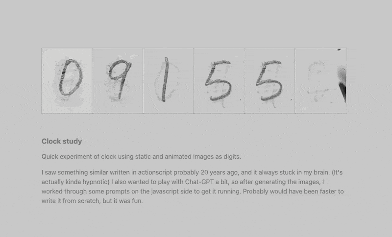

# Hypnotic clock

Quick experiment of clock using static and animated images as digits.

I saw something similar written in actionscript probably 20 years ago, and it always stuck in my brain. (It's actually kinda hypnotic) I also wanted to play with Chat-GPT a bit, so after generating the images, I worked through some prompts on the javascript side to get it running. Probably would have been faster to write it from scratch, but it was fun.

https://nyan-matt.github.io/hypnotic-clock/
